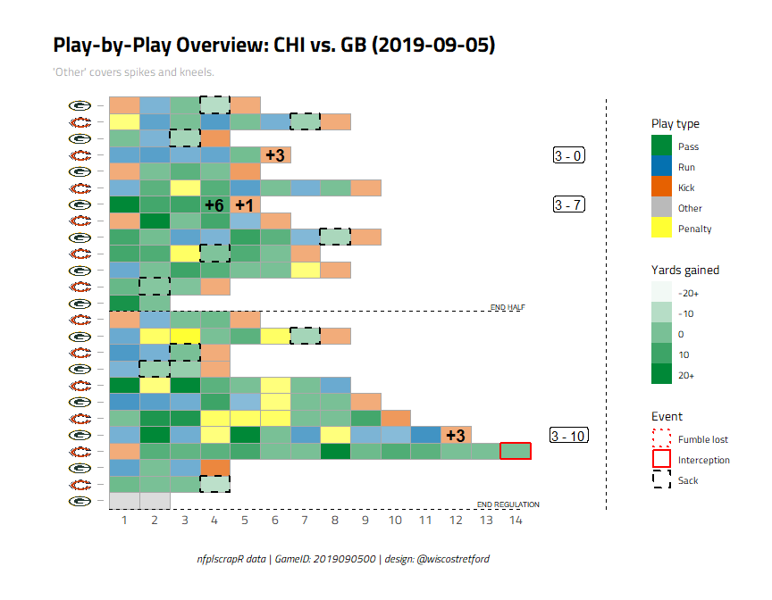

This code walks through how to generate a basic play-by-play sequence overview for NFL games, as developed by [@wiscostretford](twitter.com/wiscostretford).

# Loading libraries


```r
library(tidyverse)
library(nflscrapR)
library(ggimage)
library(hrbrthemes)
```

# Downloading play-by-play data using nflscrapR

Using nflscrapR's functions, we can download the play-by-play (pbp) data for any game. Let's take the 2019 season opener, Packers @ Bears, as an example.

To find the game_id (2019090500), we use the scrape_game_ids() function.


```r
scrape_game_ids(2019, weeks = 1)
```

```
## Loading required package: XML
```

```
## Loading required package: RCurl
```

```
## Loading required package: bitops
```

```
## 
## Attaching package: 'RCurl'
```

```
## The following object is masked from 'package:tidyr':
## 
##     complete
```

```
##    type    game_id home_team away_team week season state_of_game
## 1   reg 2019090500       CHI        GB    1   2019          POST
## 2   reg 2019090800       CAR        LA    1   2019          POST
## 3   reg 2019090806       PHI       WAS    1   2019          POST
## 4   reg 2019090805       NYJ       BUF    1   2019          POST
## 5   reg 2019090804       MIN       ATL    1   2019          POST
## 6   reg 2019090803       MIA       BAL    1   2019          POST
## 7   reg 2019090802       JAX        KC    1   2019          POST
## 8   reg 2019090801       CLE       TEN    1   2019          POST
## 9   reg 2019090807       LAC       IND    1   2019          POST
## 10  reg 2019090808       SEA       CIN    1   2019          POST
## 11  reg 2019090811        TB        SF    1   2019          POST
## 12  reg 2019090810       DAL       NYG    1   2019          POST
## 13  reg 2019090809       ARI       DET    1   2019          POST
## 14  reg 2019090812        NE       PIT    1   2019          POST
## 15  reg 2019090900        NO       HOU    1   2019          POST
## 16  reg 2019090901       OAK       DEN    1   2019          POST
##                                                                    game_url
## 1  http://www.nfl.com/liveupdate/game-center/2019090500/2019090500_gtd.json
## 2  http://www.nfl.com/liveupdate/game-center/2019090800/2019090800_gtd.json
## 3  http://www.nfl.com/liveupdate/game-center/2019090806/2019090806_gtd.json
## 4  http://www.nfl.com/liveupdate/game-center/2019090805/2019090805_gtd.json
## 5  http://www.nfl.com/liveupdate/game-center/2019090804/2019090804_gtd.json
## 6  http://www.nfl.com/liveupdate/game-center/2019090803/2019090803_gtd.json
## 7  http://www.nfl.com/liveupdate/game-center/2019090802/2019090802_gtd.json
## 8  http://www.nfl.com/liveupdate/game-center/2019090801/2019090801_gtd.json
## 9  http://www.nfl.com/liveupdate/game-center/2019090807/2019090807_gtd.json
## 10 http://www.nfl.com/liveupdate/game-center/2019090808/2019090808_gtd.json
## 11 http://www.nfl.com/liveupdate/game-center/2019090811/2019090811_gtd.json
## 12 http://www.nfl.com/liveupdate/game-center/2019090810/2019090810_gtd.json
## 13 http://www.nfl.com/liveupdate/game-center/2019090809/2019090809_gtd.json
## 14 http://www.nfl.com/liveupdate/game-center/2019090812/2019090812_gtd.json
## 15 http://www.nfl.com/liveupdate/game-center/2019090900/2019090900_gtd.json
## 16 http://www.nfl.com/liveupdate/game-center/2019090901/2019090901_gtd.json
##    home_score away_score
## 1           3         10
## 2          27         30
## 3          32         27
## 4          16         17
## 5          28         12
## 6          10         59
## 7          26         40
## 8          13         43
## 9          30         24
## 10         21         20
## 11         17         31
## 12         35         17
## 13         27         27
## 14         33          3
## 15         30         28
## 16         24         16
```

Then we scrape the pbp data using scrape_json_play_by_play(), and check out the data structure. It may take a minute or so to scrape the data. Alternatively, the raw data for completed games can be grabbed in the [nflscrapr-data](https://github.com/ryurko/nflscrapR-data) repo.


```r
pbp <- scrape_json_play_by_play(2019090500)

head(pbp)
```

```
## # A tibble: 6 x 256
##   play_id game_id home_team away_team posteam posteam_type defteam
##   <chr>     <dbl> <chr>     <chr>     <chr>   <chr>        <chr>  
## 1 35       2.02e9 CHI       GB        GB      away         CHI    
## 2 50       2.02e9 CHI       GB        GB      away         CHI    
## 3 71       2.02e9 CHI       GB        GB      away         CHI    
## 4 95       2.02e9 CHI       GB        GB      away         CHI    
## 5 125      2.02e9 CHI       GB        GB      away         CHI    
## 6 155      2.02e9 CHI       GB        CHI     home         GB     
## # ... with 249 more variables: side_of_field <chr>, yardline_100 <dbl>,
## #   game_date <date>, quarter_seconds_remaining <dbl>,
## #   half_seconds_remaining <dbl>, game_seconds_remaining <dbl>,
## #   game_half <chr>, quarter_end <dbl>, drive <int>, sp <dbl>, qtr <dbl>,
## #   down <fct>, goal_to_go <dbl>, time <chr>, yrdln <chr>, ydstogo <dbl>,
## #   ydsnet <dbl>, desc <chr>, play_type <chr>, yards_gained <dbl>,
## #   shotgun <dbl>, no_huddle <dbl>, qb_dropback <dbl>, qb_kneel <dbl>,
## #   qb_spike <dbl>, qb_scramble <dbl>, pass_length <chr>,
## #   pass_location <chr>, air_yards <dbl>, yards_after_catch <dbl>,
## #   run_location <chr>, run_gap <chr>, field_goal_result <chr>,
## #   kick_distance <dbl>, extra_point_result <chr>,
## #   two_point_conv_result <chr>, home_timeouts_remaining <dbl>,
## #   away_timeouts_remaining <dbl>, timeout <dbl>, timeout_team <chr>,
## #   td_team <chr>, posteam_timeouts_remaining <dbl>,
## #   defteam_timeouts_remaining <dbl>, total_home_score <dbl>,
## #   total_away_score <dbl>, posteam_score <dbl>, defteam_score <dbl>,
## #   score_differential <dbl>, posteam_score_post <dbl>,
## #   defteam_score_post <dbl>, score_differential_post <dbl>,
## #   no_score_prob <dbl>, opp_fg_prob <dbl>, opp_safety_prob <dbl>,
## #   opp_td_prob <dbl>, fg_prob <dbl>, safety_prob <dbl>, td_prob <dbl>,
## #   extra_point_prob <dbl>, two_point_conversion_prob <dbl>, ep <dbl>,
## #   epa <dbl>, total_home_epa <dbl>, total_away_epa <dbl>,
## #   total_home_rush_epa <dbl>, total_away_rush_epa <dbl>,
## #   total_home_pass_epa <dbl>, total_away_pass_epa <dbl>, air_epa <dbl>,
## #   yac_epa <dbl>, comp_air_epa <dbl>, comp_yac_epa <dbl>,
## #   total_home_comp_air_epa <dbl>, total_away_comp_air_epa <dbl>,
## #   total_home_comp_yac_epa <dbl>, total_away_comp_yac_epa <dbl>,
## #   total_home_raw_air_epa <dbl>, total_away_raw_air_epa <dbl>,
## #   total_home_raw_yac_epa <dbl>, total_away_raw_yac_epa <dbl>, wp <dbl>,
## #   def_wp <dbl>, home_wp <dbl>, away_wp <dbl>, wpa <dbl>,
## #   home_wp_post <dbl>, away_wp_post <dbl>, total_home_rush_wpa <dbl>,
## #   total_away_rush_wpa <dbl>, total_home_pass_wpa <dbl>,
## #   total_away_pass_wpa <dbl>, air_wpa <dbl>, yac_wpa <dbl>,
## #   comp_air_wpa <dbl>, comp_yac_wpa <dbl>, total_home_comp_air_wpa <dbl>,
## #   total_away_comp_air_wpa <dbl>, total_home_comp_yac_wpa <dbl>,
## #   total_away_comp_yac_wpa <dbl>, total_home_raw_air_wpa <dbl>, ...
```

# Data choices, cleaning and grouping

To produce a useful overview, we have to do some choices, including cleaning and grouping the same. There are simply too many different play types, outcomes and variables for each play to visualize. Here, we will focus on sequencing of basic play types, yards gained, scoring, and key defensive actions. Thus, we need to isolate those variables, and create some new ones to deal with edge cases that are not addressed in the pbp data.


```r
# First we compile the play types into five base categories (pass, run, kick, penalty, other)

pbp2 <- pbp %>% 
  mutate(play_type = case_when(play_type == "no_play" & penalty > 0 ~ "Penalty", TRUE ~ as.character(play_type))) %>% # this translates instances of pre-snap penalties to a 'Penalty' play rather than a no_play 
  mutate(play_type2 = case_when(
    play_type == "pass" ~ "Pass",
    play_type == "run" ~ "Run",
    play_type == "qb_spike" ~ "Other",
    play_type == "qb_kneel" ~ "Other",
    play_type == "field_goal" ~ "Kick",
    play_type == "extra_point" ~ "Kick",
    play_type == "kickoff" ~ "Kick",
    play_type == "punt" ~ "Kick",
    play_type == "Penalty" ~ "Penalty",
    TRUE ~ as.character(play_type))) %>% 
  
# Next we create a new variable that shows score changes by comparing the pre- and post-play team scores

  mutate(scorechange = ifelse(
    posteam_score != posteam_score_post, 
    posteam_score_post - posteam_score,
    defteam_score - defteam_score_post)) %>% 
    
# Next we create dummy variables for key defensive actions - fumble recoveries, interceptions, and sacks
    
  mutate(other = case_when(
    fumble_lost > 0 ~ "Fumble lost",
    interception > 0 ~ "Interception",
    sack > 0 ~ "Sack",
    TRUE ~ "")) %>%

# Next we filter out unknown/missing plays or no plays
    
  filter(!is.na(play_type)) %>% 
  filter(!play_type == "no_play") %>%
    
# Next we create a 'step' variable to represent the play number in a given possession
  
  group_by(drive) %>% 
  mutate(
    step = row_number(),
    label = paste0(posteam," (drive ",drive,")")) %>%

# Next we compile a new variable, 'ydsgained2', to represent yards gained from plays or penalties:
    
  mutate(
  ydsgained2 = case_when(
    penalty > 0 ~ penalty_yards,
    TRUE ~ yards_gained)) %>% 

# Next we make sure the play_id is in the right numeric format:

  mutate(play_id = as.numeric(play_id))

# Finally before plotting we add in the team logos, to be used for plotting:

nfllogos <- read.csv("https://raw.githubusercontent.com/statsbylopez/BlogPosts/master/nfl_teamlogos.csv") %>% mutate(team_code = as.character(team_code))

pbp2 <- left_join(pbp2,nfllogos,by=c("posteam"="team_code"))
```

```
## Warning: `chr_along()` is deprecated as of rlang 0.2.0.
## This warning is displayed once per session.
```

Now we are ready to plot, which we'll do in a tiled format for illustrate the play-by-play sequencing.


```r
# Base tile

p <- ggplot(data = pbp2) +
  geom_tile(
    aes(
      y=reorder(reorder(label,-drive),-play_id),
      x=step,
      fill=play_type2,
      alpha=ydsgained2),
    colour="darkgrey") +
    
  scale_fill_manual(limits=c("Pass","Run","Kick","Other","Penalty"),breaks=c("Pass","Run","Kick","Other","Penalty"),values=c("Pass"="#008837","Run"="#0571b0","Other"="#bababa","Kick"="#e66101","Penalty"="#ffff33"),name="Play type") +
    
  scale_alpha(range=c(0.05,1),limits=c(-20,20),breaks=c(-20,-10,0,10,20),labels=c("-20+","-10","0","10","20+"),name="Yards gained") +
  
  scale_x_continuous(breaks=1:max(pbp2$step)) +
  
# Adding NFL logos on the x axis

  geom_image(
    aes(
      y=reorder(reorder(label,-drive),-play_id),
      x=-0.5,
      image=url),
    size=0.04) +
    
  geom_segment(
    aes(
      y = reorder(reorder(label,-drive),-play_id),
      yend = reorder(reorder(label,-drive),-play_id),
      x = 0.1,
      xend = 0.3),
    colour="darkgrey")

# Adding half time and final markers and text

halftime <- pbp2 %>% # identifying where in the drive label sequence half time and full time are
  filter(game_half!="Overtime") %>% 
  group_by(game_half) %>% 
  top_n(.,-1,-play_id) %>% 
  select(game_half,label) %>% 
  mutate(y = length(unique(pbp2$label)) - which(unique(pbp2$label)==label) + 0.5)

p <- p + geom_segment(data = halftime,
    aes(
      y = y, 
      yend = y, 
      x = 0.5,
      xend = max(pbp2$step)+0.25),
    linetype="dashed") +
    
  geom_label(data = halftime,
    aes(
      y = y,
      x = max(pbp2$step)-0.25,
      label=ifelse(game_half=="Half1","END HALF",ifelse(game_half=="Half2","END REGULATION",""))),
    label.size = 0, size = 2, vjust = -0.25, label.padding = unit(0.01,"cm"))

# Adding score text and notation

p <- p +
  
  geom_text(data=pbp2 %>% filter(scorechange!=0), # plotting for possession team scores 
  aes(
    y=reorder(reorder(label,-drive),-play_id),
    x=step,
    label=ifelse(scorechange>0,paste0("+",scorechange),"")),
  fontface="bold",
  size=5) +
  
  geom_text(data=pbp2 %>% filter(scorechange!=0), # plotting for defensive team scores
  aes(
    y=reorder(reorder(label,-drive),-play_id),
    x=step,
    label=ifelse(scorechange<0,paste0("+",abs(scorechange)),"")),
  fontface="bold",
  size=5,
  colour="red") +

  geom_label(data=pbp2 %>% filter(scorechange!=0) %>% group_by(drive) %>% top_n(.,-1,-play_id), # adding a score summary for each new score
  aes(
    y=reorder(reorder(label,-drive),-play_id),
    x=max(pbp2$step)+1.75,
    label=paste(total_home_score,"-",total_away_score)),
  label.padding=unit(0.15,"lines"))

# Plotting new tile surrounds for key defensive actions (fumbles, interceptions, sacks)

p <- p + geom_tile(data=pbp2 %>% filter(other!=""),
  aes(
    y=reorder(reorder(label,-drive),-play_id),
    x=step,
    fill=NA,
    linetype=other,
    colour=other),
  size=1,
  width=1) +
  
  scale_colour_manual(limits=c("Fumble lost","Interception","Sack"),name="Event", values=c("red","red","black")) +
  
  scale_linetype_manual(limits=c("Fumble lost","Interception","Sack"),name="Event",values=c("Fumble lost"="dotted","Interception"="solid","Sack"="dashed"))

# Adding a spacing line between the plot and the legends

p  <- p + geom_vline(aes(xintercept=max(pbp2$step+3)),linetype="dashed")

# Adding theme customizations, using hrbrthemes' nice and clear ipsum_tw theme

p <- p +
  theme_ipsum_tw() +
  theme(
    panel.grid.major = element_blank(), 
    panel.grid.minor = element_blank(),
    plot.subtitle=element_text(colour="darkgrey",size=9.5),
    plot.caption=element_text(face="italic",hjust=0.5),
    axis.text.y=element_blank()) +

# Adding labels
  
  labs(
    y = "",
    x = "",
    title = paste0("Play-by-Play Overview: ",pbp2$home_team[1]," vs. ",pbp2$away_team[1]," (",pbp2$game_date[1],")"),
    subtitle = "'Other' covers spikes and kneels.",
    caption = paste0("nfplscrapR data | GameID: ",pbp2$game_id[1], " | design: @wiscostretford")) +
  
# Sorting and colouring legends
  
  guides(
    fill = guide_legend(order = 1,override.aes=list(colour=NA)), 
    alpha = guide_legend(order = 2,override.aes=list(fill="#008837",colour=NA)),
    colour = guide_legend(order = 3,override.aes=list(fill=NA)),
    linetype = guide_legend(order = 3))

# Final plot

p
```

<!-- -->


  

    

